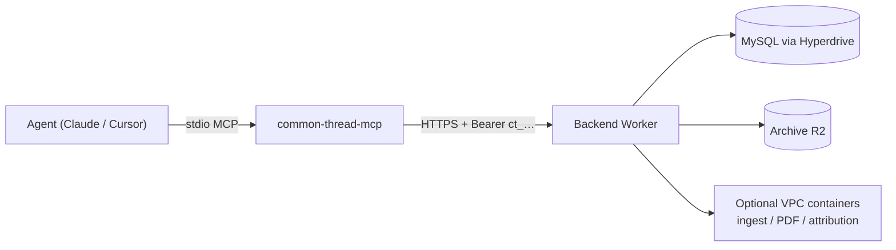

# Common Thread MCP

> **Package vs product:** this npm package is an MIT **client door**. The methodology paper and
> reference Worker live in [common-thread](https://github.com/skyphusion-labs/common-thread) (CC-BY
> paper + AGPL implementation). This MCP speaks the HTTP API only; it does not re-license the product.

Drive Common Thread from an AI agent (Claude Code, Cursor, or any [Model Context Protocol](https://modelcontextprotocol.io/) client) instead of the browser UI or raw `curl`. Implementation: **`@skyphusion/common-thread-mcp`** (stdio server).

**Version:** trust root `package.json` / git tags / this file's examples (currently **0.1.x**).

## Contents

- [What this is](#what-this-is)
- [Architecture](#architecture)
- [Install](#install)
- [Configure the agent](#configure-the-agent)
- [Environment](#environment)
- [Auth model](#auth-model)
- [Typical workflow](#typical-workflow)
- [Tool reference](#tool-reference)
- [Hosted API policy](#hosted-api-policy)
- [Security](#security)
- [Troubleshooting](#troubleshooting)
- [Develop and release](#develop-and-release)
- [Files](#files)

## What this is

Common Thread attributes coordinated inauthentic behavior from **public** behavioral signals. Given seed accounts, it emits calibrated claims at three bands (`insufficient`, `consistent`, `strongly_consistent`). It stops at cluster-level attribution; it never identifies natural persons.

The public UI is at [common-thread.skyphusion.org](https://common-thread.skyphusion.org). This MCP exposes the **same backend API** that UI uses, so an agent can:

1. Create an investigation and store the one-time capability token
2. Add seeds and ingest Apify Twitter exports
3. Poll extractors / features
4. Run attribution (BYOK on the public host)
5. Export evidence packets (JSON, Markdown, or PDF)
6. Seal or delete investigations

Paper and privacy posture: product repo `docs/PRIVACY-COMMITMENT.md`, `docs/PAPER-GAPS.md`, `docs/API.md`.

## Architecture



- **Transport:** stdio JSON-RPC (MCP SDK). **stdout is protocol only**; logs go to stderr.
- **No product secrets in the package.** API URL, capability tokens, and BYOK keys are env or per-tool args.
- **Self-host or hosted.** Point `COMMON_THREAD_API_URL` at your Worker or the public backend.

## Install

```bash
npm install -g @skyphusion/common-thread-mcp
# or one-shot without install
npx -y @skyphusion/common-thread-mcp
```

Requires **Node >= 20**.

## Configure the agent

### Claude Code / Claude Desktop

```json
{
  "mcpServers": {
    "common-thread": {
      "command": "npx",
      "args": ["-y", "@skyphusion/common-thread-mcp"],
      "env": {
        "COMMON_THREAD_API_URL": "https://common-thread-backend.skyphusion.org",
        "COMMON_THREAD_AI_GATEWAY_URL": "https://gateway.ai.cloudflare.com/v1/ACCOUNT/GATEWAY/anthropic",
        "COMMON_THREAD_ANTHROPIC_API_KEY": "sk-ant-..."
      }
    }
  }
}
```

After `create_investigation`, set defaults so later tools need fewer args:

```json
"COMMON_THREAD_INVESTIGATION_ID": "my-case-1",
"COMMON_THREAD_ACCESS_TOKEN": "ct_..."
```

Or pass `investigation_id` and `access_token` on every tool call (preferred when juggling several cases).

### Cursor / other MCP clients

Same shape: command `npx` (or path to `common-thread-mcp` / `node dist/index.js`), env as above.

## Environment

| Variable | Required | Purpose |
|----------|----------|---------|
| `COMMON_THREAD_API_URL` | No | Backend base URL (default `https://common-thread-backend.skyphusion.org`) |
| `COMMON_THREAD_ACCESS_TOKEN` | No* | Default capability token `ct_…` |
| `COMMON_THREAD_INVESTIGATION_ID` | No* | Default investigation id |
| `COMMON_THREAD_AI_GATEWAY_URL` | Public attribute | BYOK gateway (`…/anthropic` or `https://api.anthropic.com`) |
| `COMMON_THREAD_ANTHROPIC_API_KEY` | Public attribute | Anthropic API key (or use CF token) |
| `COMMON_THREAD_CF_AIG_TOKEN` | Public attribute | AI Gateway Run token (keyless Unified Billing) |
| `COMMON_THREAD_API_TIMEOUT_MS` | No | Request timeout ms (default `120000`) |

\*Per-tool args always override env defaults.

## Auth model

| Call | Auth |
|------|------|
| `health`, `create_investigation` | None |
| Everything under `/investigations/:id` | `Authorization: Bearer ct_…` (or `X-Investigation-Token` / query on GET only; MCP uses Bearer) |
| Public hosted `attribute` | BYOK headers/body as well as capability token |

**Capability token is shown once** at create. The server stores only a SHA-256 hash. Lose it and you cannot recover access; create a new investigation.

New investigations are **encrypted at rest**; the key is derived from the token (product §3.5). Losing the token means unrecoverable ciphertext.

Sealed / archived investigations: **read** with the token; **write** routes refuse (`read_only`).

## Typical workflow

```text
health
create_investigation          -> store id + access_token (once)
add_seed (optional)           -> seeds also appear via ingest
ingest_apify_twitter          -> jobId (202 async or 200 inline)
get_ingest_job (poll)         -> completed
list_features                 -> verify extractors
attribute (BYOK on public)    -> 200 runs or 202 jobId
get_attribution_job (if 202)
list_runs / get_run
get_packet (json|markdown|pdf)
seal_investigation            -> read-only thereafter
```

Optional: `update_investigation_metadata` (triggering events / time bounds), `list_manifest` / `verify_manifest`, `delete_investigation` only while `active`.

## Tool reference

**23** tools. Arguments marked **(required)** must be present unless env defaults cover investigation id/token.

### Health and lifecycle

**`health`** -- `GET /`. Backend name, version, environment, optional hosted-API notice.

**`create_investigation`** -- `POST /investigations`.
- `id` (required): stable slug, unique on this backend
- `name` (required): title
- `description`: optional

Returns `access_token` once. **Store it.**

**`get_investigation`** -- `GET /investigations/:id`. Metadata + practitioner metadata.
- `investigation_id`, `access_token` (or env defaults)

**`update_investigation_metadata`** -- `PATCH /investigations/:id/metadata` (active only).
- `triggering_events`: `[{ id, timestamp, description?, platform_post_id? }]`
- `time_bounds`: `{ start, end, justification }` or `null` to clear

**`seal_investigation`** -- `POST /investigations/:id/seal`. Idempotent when already sealed.

**`delete_investigation`** -- `DELETE /investigations/:id`. Hard-delete **active** only. Sealed/archived refuse. Content-addressed `sha256/` blobs retained.

**`investigation_summary`** -- `GET /investigations/:id/summary`. Seed + manifest counts.

### Seeds

**`list_seeds`** -- `GET /investigations/:id/seeds`.
- `include_removed`: boolean

**`add_seed`** -- `POST /investigations/:id/seeds` (active only).
- `platform` (required), e.g. `twitter`
- `account` (required): handle
- `basis_statement` (required): why this account is in the seed set (§5.1.1)
- `is_control`: boolean
- `added_by`: actor label (default `common-thread-mcp`)

Cap: `MAX_SEED_ACCOUNTS` on the Worker (default 50).

**`remove_seed`** -- `DELETE /investigations/:id/seeds`. Soft-delete (audit row kept).
- `platform`, `account` (required)
- `removed_reason`: optional

### Features and ingest

**`list_features`** -- `GET /investigations/:id/features`.
- Filters: `account`, `platform`, `pair` (`a,b`), `account_a` / `account_b`, `category`, `scope` (`account|pair|event|all`), `include_provenance`

**`ingest_apify_twitter`** -- `POST /investigations/:id/ingest/apify-twitter` (active only).
- `items` (required): JSON array of Apify items, or `{ items|data: [...] }`

Returns `jobId` (and may complete inline with `200` or delegate with `202`). Cap: `MAX_INGEST_ITEMS` (default 5000).

**`get_ingest_job`** -- `GET /investigations/:id/ingest-jobs/:job_id`.
- `job_id` (required)

### Attribution

**`attribute`** -- `POST /investigations/:id/attribute` (active only; **spends LLM**).
- `skip_triage`: boolean
- `account_filter`: string array
- `max_retries`, `randomization_seed`
- BYOK: `ai_gateway_url`, `anthropic_api_key`, and/or `cf_aig_token` (or env)

Public host with `PUBLIC_BYOK_ONLY` requires BYOK. May return **200** (sync runs) or **202** `{ jobId, mode: "async" }`.

**`get_attribution_job`** -- poll async attribution.
- `job_id` (required)

**`list_runs`** -- `GET /investigations/:id/runs` (summaries).

**`get_run`** -- `GET /investigations/:id/runs/:run_id` (parsed output: claims, alternatives, triage, …).
- `run_id` (required)

### Evidence packets and archive

**`get_packet`** -- evidence packet (§8.1).
- `run_id`: omit for latest run
- `format`: `json` (default) | `markdown` | `pdf` (base64; needs PDF worker)
- `practitioner`, `redact`, `redact_accounts`

**`list_manifest`** -- `GET /manifest?investigation=`

**`list_signatures`** -- `GET /signatures?investigation=`

**`verify_manifest`** -- `GET /verify?investigation=`

### Debug (dev)

**`debug_ingest`** / **`debug_manifest`** -- extractor/manifest visibility. Not methodology deliverables.

## Hosted API policy

The production API at `https://common-thread-backend.skyphusion.org` is operated for the public UI and **approved** integrations. It is **not** a general open API for third-party products.

- Self-host freely (AGPL) and point this MCP at your Worker: [common-thread SETUP](https://github.com/skyphusion-labs/common-thread/blob/main/docs/SETUP.md).
- Heavy or productized use of the hosted backend: contact **common-thread@skyphusion.org** first (see product `docs/API.md` / `docs/contact.md`).

CORS does not apply to this MCP (no browser `Origin`); the policy is operational, not a technical CORS gate.

## Security

- Treat `ct_…` tokens as capability credentials: anyone holding one can read (and mutate while active).
- Never log tokens or BYOK keys to transcripts or chat history.
- Prefer env for long-lived BYOK; pass per-call only when necessary.
- Prefer self-host for high-sensitivity investigations.
- stdout is MCP only; operators reading logs use stderr.

Detail: [SECURITY.md](SECURITY.md). Parity with the website: [PARITY.md](PARITY.md).

## Troubleshooting

| Symptom | Meaning | Fix |
|---------|---------|-----|
| `access_token is required` | No env default and no tool arg | Create investigation and store token, or set `COMMON_THREAD_ACCESS_TOKEN` |
| `HTTP 401` / `invalid_token` | Wrong token or wrong investigation | Re-create or fix id/token pair |
| `HTTP 403` / `read_only` | Sealed or archived | Use read tools only, or a new investigation |
| `byok_required` / 400 on attribute | Public host without BYOK | Set gateway URL + Anthropic key or CF AIG token |
| `ingest_cap_exceeded` / `seed_cap_exceeded` / `pair_cap_exceeded` | Worker resource caps | Split uploads, remove seeds, or narrow `account_filter` |
| `request timed out` | Long attribution / large ingest | Raise `COMMON_THREAD_API_TIMEOUT_MS`; poll jobs instead of one long call |
| PDF `503` | PDF container not configured | Use `format=json` or `markdown`, or self-host with PDF worker |

## Develop and release

```bash
npm ci
npm run typecheck
npm test
npm run build
node dist/index.js   # stdio
```

Release: bump `package.json` + `src/version.ts` together (test enforces match), PR to `main`, annotated tag `vX.Y.Z` → npm publish workflow.

## Files

| Path | Role |
|------|------|
| `src/index.ts` | stdio MCP entry |
| `src/tools.ts` | Tool catalog + handlers |
| `src/client.ts` | HTTP client (User-Agent, BYOK headers) |
| `src/version.ts` | Advertised `serverInfo.version` |
| `docs/mcp.md` | This guide |
| `docs/PARITY.md` | Website vs tools |
| `docs/SECURITY.md` | Credential and boundary notes |

Authoritative HTTP contract: [common-thread `docs/API.md`](https://github.com/skyphusion-labs/common-thread/blob/main/docs/API.md).
